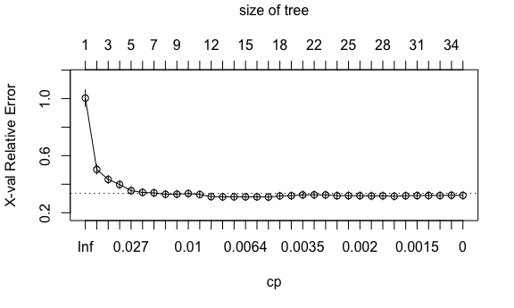

Data Science II Homework 4
================
Roxy Zhang
4/1/2022

## Question 1

``` r
set.seed(0409)

# data import and cleaning
df = read_csv("College.csv") %>% 
  janitor::clean_names() %>% 
  select(-college) %>% 
  select(outstate, everything()) %>% 
  na.omit()

# data partition
indexTrain = createDataPartition(y = df$outstate,
                                 p = 0.8,
                                 list = FALSE)


train_df = df[indexTrain, ]
test_df = df[-indexTrain, ]

x_train = model.matrix(outstate ~ ., train_df)[ , -1]
y_train = train_df$outstate

x_test = model.matrix(outstate ~ ., test_df)[ , -1]
y_test = test_df$outstate
```

1.  Build a regression tree on the training data to predict the
    response. Create a plot of the tree.

``` r
set.seed(0409)

reg_tree = rpart(formula = outstate ~ . ,
                 data = train_df,
                 control = rpart.control(cp = 0)) 

# cp table
reg_tree_cptable = reg_tree$cptable

# cross-validation plot
plotcp(reg_tree)
```



``` r
# minimum cross_validation error
min_err = which.min(reg_tree_cptable[,4])

# pruning
reg_tree_prune = prune(reg_tree, 
                       cp = reg_tree_cptable[min_err,1])

summary(reg_tree_prune) 
```

    ## Call:
    ## rpart(formula = outstate ~ ., data = train_df, control = rpart.control(cp = 0))
    ##   n= 453 
    ## 
    ##             CP nsplit rel error    xerror       xstd
    ## 1  0.516644949      0 1.0000000 1.0036910 0.05949259
    ## 2  0.097254873      1 0.4833551 0.5032171 0.03228315
    ## 3  0.047797490      2 0.3861002 0.4332068 0.02863581
    ## 4  0.039468883      3 0.3383027 0.3978343 0.02816496
    ## 5  0.018009418      4 0.2988338 0.3549916 0.02782182
    ## 6  0.015951882      5 0.2808244 0.3425717 0.02716222
    ## 7  0.015757159      6 0.2648725 0.3394083 0.02701762
    ## 8  0.014522240      7 0.2491153 0.3291852 0.02645485
    ## 9  0.011306732      8 0.2345931 0.3299925 0.02647146
    ## 10 0.009384194      9 0.2232864 0.3349493 0.02681017
    ## 11 0.008634589     10 0.2139022 0.3280208 0.02571731
    ## 12 0.006676669     11 0.2052676 0.3126588 0.02529613
    ## 13 0.006506180     12 0.1985909 0.3110489 0.02563179
    ## 14 0.006414785     13 0.1920847 0.3113046 0.02572694
    ## 15 0.006412827     14 0.1856700 0.3113046 0.02572694
    ## 16 0.006367473     15 0.1792571 0.3113046 0.02572694
    ## 17 0.006123089     16 0.1728897 0.3097964 0.02569353
    ## 
    ## Variable importance
    ##      expend    terminal   top10perc   top25perc        ph_d   s_f_ratio 
    ##          29          12          12          11          11           9 
    ##  room_board        apps f_undergrad      enroll      accept p_undergrad 
    ##           5           2           2           2           2           2 
    ## perc_alumni   grad_rate 
    ##           1           1 
    ## 
    ## Node number 1: 453 observations,    complexity param=0.5166449
    ##   mean=11809.87, MSE=1.383764e+07 
    ##   left son=2 (332 obs) right son=3 (121 obs)
    ##   Primary splits:
    ##       expend     < 11197   to the left,  improve=0.5166449, (0 missing)
    ##       terminal   < 84.5    to the left,  improve=0.3564829, (0 missing)
    ##       ph_d       < 82.5    to the left,  improve=0.3475928, (0 missing)
    ##       top10perc  < 35.5    to the left,  improve=0.3008679, (0 missing)
    ##       room_board < 3885.5  to the left,  improve=0.2829423, (0 missing)
    ##   Surrogate splits:
    ##       top10perc < 39.5    to the left,  agree=0.854, adj=0.455, (0 split)
    ##       terminal  < 92.5    to the left,  agree=0.852, adj=0.446, (0 split)
    ##       ph_d      < 89.5    to the left,  agree=0.839, adj=0.397, (0 split)
    ##       top25perc < 76.5    to the left,  agree=0.837, adj=0.388, (0 split)
    ##       s_f_ratio < 10.55   to the right, agree=0.810, adj=0.289, (0 split)
    ## 
    ## Node number 2: 332 observations,    complexity param=0.09725487
    ##   mean=10195.7, MSE=6332956 
    ##   left son=4 (110 obs) right son=5 (222 obs)
    ##   Primary splits:
    ##       room_board < 3745    to the left,  improve=0.2899526, (0 missing)
    ##       expend     < 8192.5  to the left,  improve=0.2862036, (0 missing)
    ##       terminal   < 80.5    to the left,  improve=0.1895421, (0 missing)
    ##       grad_rate  < 64.5    to the left,  improve=0.1496996, (0 missing)
    ##       ph_d       < 70.5    to the left,  improve=0.1411883, (0 missing)
    ##   Surrogate splits:
    ##       expend      < 6873    to the left,  agree=0.729, adj=0.182, (0 split)
    ##       terminal    < 63.5    to the left,  agree=0.711, adj=0.127, (0 split)
    ##       p_undergrad < 80.5    to the left,  agree=0.696, adj=0.082, (0 split)
    ##       grad_rate   < 38.5    to the left,  agree=0.690, adj=0.064, (0 split)
    ##       ph_d        < 54.5    to the left,  agree=0.681, adj=0.036, (0 split)
    ## 
    ## Node number 3: 121 observations,    complexity param=0.03946888
    ##   mean=16238.85, MSE=7664012 
    ##   left son=6 (40 obs) right son=7 (81 obs)
    ##   Primary splits:
    ##       expend     < 13103.5 to the left,  improve=0.2667924, (0 missing)
    ##       apps       < 1762    to the left,  improve=0.2463618, (0 missing)
    ##       room_board < 5470    to the left,  improve=0.2320327, (0 missing)
    ##       top25perc  < 74.5    to the left,  improve=0.2299564, (0 missing)
    ##       grad_rate  < 82.5    to the left,  improve=0.2097316, (0 missing)
    ##   Surrogate splits:
    ##       s_f_ratio < 12.2    to the right, agree=0.769, adj=0.300, (0 split)
    ##       top25perc < 66.5    to the left,  agree=0.744, adj=0.225, (0 split)
    ##       top10perc < 44.5    to the left,  agree=0.736, adj=0.200, (0 split)
    ##       terminal  < 89.5    to the left,  agree=0.711, adj=0.125, (0 split)
    ##       apps      < 970.5   to the left,  agree=0.694, adj=0.075, (0 split)
    ## 
    ## Node number 4: 110 observations,    complexity param=0.01800942
    ##   mean=8270.627, MSE=4953498 
    ##   left son=8 (53 obs) right son=9 (57 obs)
    ##   Primary splits:
    ##       perc_alumni < 18.5    to the left,  improve=0.2071835, (0 missing)
    ##       expend      < 8339    to the left,  improve=0.1643805, (0 missing)
    ##       grad_rate   < 65.5    to the left,  improve=0.1327099, (0 missing)
    ##       terminal    < 79.5    to the left,  improve=0.1189497, (0 missing)
    ##       s_f_ratio   < 17.65   to the right, improve=0.1115850, (0 missing)
    ##   Surrogate splits:
    ##       grad_rate < 62.5    to the left,  agree=0.682, adj=0.340, (0 split)
    ##       personal  < 1310    to the right, agree=0.664, adj=0.302, (0 split)
    ##       ph_d      < 64.5    to the left,  agree=0.636, adj=0.245, (0 split)
    ##       terminal  < 67.5    to the left,  agree=0.636, adj=0.245, (0 split)
    ##       top25perc < 40.5    to the left,  agree=0.627, adj=0.226, (0 split)
    ## 
    ## Node number 5: 222 observations,    complexity param=0.04779749
    ##   mean=11149.56, MSE=4270358 
    ##   left son=10 (109 obs) right son=11 (113 obs)
    ##   Primary splits:
    ##       expend    < 8545.5  to the left,  improve=0.3160444, (0 missing)
    ##       accept    < 824.5   to the left,  improve=0.1874288, (0 missing)
    ##       apps      < 1181    to the left,  improve=0.1815399, (0 missing)
    ##       terminal  < 80.5    to the left,  improve=0.1725715, (0 missing)
    ##       top10perc < 22.5    to the left,  improve=0.1669107, (0 missing)
    ##   Surrogate splits:
    ##       ph_d      < 69.5    to the left,  agree=0.707, adj=0.404, (0 split)
    ##       terminal  < 75.5    to the left,  agree=0.676, adj=0.339, (0 split)
    ##       top10perc < 22.5    to the left,  agree=0.653, adj=0.294, (0 split)
    ##       top25perc < 49.5    to the left,  agree=0.644, adj=0.275, (0 split)
    ##       s_f_ratio < 14.05   to the right, agree=0.635, adj=0.257, (0 split)
    ## 
    ## Node number 6: 40 observations,    complexity param=0.009384194
    ##   mean=14204.02, MSE=5236561 
    ##   left son=12 (11 obs) right son=13 (29 obs)
    ##   Primary splits:
    ##       apps        < 953.5   to the left,  improve=0.2808348, (0 missing)
    ##       accept      < 921.5   to the left,  improve=0.2671020, (0 missing)
    ##       personal    < 1125    to the right, improve=0.2533057, (0 missing)
    ##       f_undergrad < 1206    to the left,  improve=0.2004246, (0 missing)
    ##       room_board  < 4421    to the left,  improve=0.1334797, (0 missing)
    ##   Surrogate splits:
    ##       accept      < 854     to the left,  agree=0.950, adj=0.818, (0 split)
    ##       f_undergrad < 1074    to the left,  agree=0.925, adj=0.727, (0 split)
    ##       enroll      < 296.5   to the left,  agree=0.875, adj=0.545, (0 split)
    ##       terminal    < 79      to the left,  agree=0.800, adj=0.273, (0 split)
    ##       top10perc   < 20.5    to the left,  agree=0.775, adj=0.182, (0 split)
    ## 
    ## Node number 7: 81 observations,    complexity param=0.01595188
    ##   mean=17243.7, MSE=5808325 
    ##   left son=14 (38 obs) right son=15 (43 obs)
    ##   Primary splits:
    ##       room_board  < 5557.5  to the left,  improve=0.2125378, (0 missing)
    ##       apps        < 1455    to the left,  improve=0.2013531, (0 missing)
    ##       grad_rate   < 67.5    to the left,  improve=0.1896768, (0 missing)
    ##       f_undergrad < 868.5   to the left,  improve=0.1781587, (0 missing)
    ##       enroll      < 263.5   to the left,  improve=0.1696629, (0 missing)
    ##   Surrogate splits:
    ##       apps        < 3405    to the left,  agree=0.716, adj=0.395, (0 split)
    ##       enroll      < 497.5   to the left,  agree=0.716, adj=0.395, (0 split)
    ##       f_undergrad < 1712    to the left,  agree=0.716, adj=0.395, (0 split)
    ##       expend      < 14732.5 to the left,  agree=0.691, adj=0.342, (0 split)
    ##       p_undergrad < 24.5    to the left,  agree=0.679, adj=0.316, (0 split)
    ## 
    ## Node number 8: 53 observations,    complexity param=0.00650618
    ##   mean=7220.038, MSE=2700428 
    ##   left son=16 (19 obs) right son=17 (34 obs)
    ##   Primary splits:
    ##       expend      < 6421.5  to the left,  improve=0.2849560, (0 missing)
    ##       room_board  < 3056    to the left,  improve=0.2789270, (0 missing)
    ##       books       < 475     to the right, improve=0.1658577, (0 missing)
    ##       s_f_ratio   < 12.45   to the right, improve=0.1459040, (0 missing)
    ##       perc_alumni < 13.5    to the left,  improve=0.1402671, (0 missing)
    ##   Surrogate splits:
    ##       s_f_ratio   < 14.95   to the right, agree=0.811, adj=0.474, (0 split)
    ##       room_board  < 3018    to the left,  agree=0.792, adj=0.421, (0 split)
    ##       top25perc   < 31      to the left,  agree=0.698, adj=0.158, (0 split)
    ##       top10perc   < 10.5    to the left,  agree=0.679, adj=0.105, (0 split)
    ##       p_undergrad < 666     to the right, agree=0.679, adj=0.105, (0 split)
    ## 
    ## Node number 9: 57 observations,    complexity param=0.01130673
    ##   mean=9247.491, MSE=5067912 
    ##   left son=18 (11 obs) right son=19 (46 obs)
    ##   Primary splits:
    ##       s_f_ratio   < 16.85   to the right, improve=0.2453541, (0 missing)
    ##       grad_rate   < 66.5    to the left,  improve=0.2358876, (0 missing)
    ##       terminal    < 77.5    to the left,  improve=0.2173638, (0 missing)
    ##       f_undergrad < 2744.5  to the right, improve=0.1828332, (0 missing)
    ##       expend      < 8339    to the left,  improve=0.1700479, (0 missing)
    ##   Surrogate splits:
    ##       p_undergrad < 1051    to the right, agree=0.895, adj=0.455, (0 split)
    ##       expend      < 5003    to the left,  agree=0.895, adj=0.455, (0 split)
    ##       f_undergrad < 2744.5  to the right, agree=0.860, adj=0.273, (0 split)
    ##       enroll      < 645.5   to the right, agree=0.842, adj=0.182, (0 split)
    ##       apps        < 2081    to the right, agree=0.825, adj=0.091, (0 split)
    ## 
    ## Node number 10: 109 observations,    complexity param=0.006676669
    ##   mean=9966.706, MSE=2492093 
    ##   left son=20 (74 obs) right son=21 (35 obs)
    ##   Primary splits:
    ##       apps        < 1383.5  to the left,  improve=0.15407400, (0 missing)
    ##       grad_rate   < 50.5    to the left,  improve=0.12799700, (0 missing)
    ##       expend      < 7061    to the left,  improve=0.12459870, (0 missing)
    ##       f_undergrad < 1180.5  to the left,  improve=0.10298040, (0 missing)
    ##       accept      < 1046.5  to the left,  improve=0.09550702, (0 missing)
    ##   Surrogate splits:
    ##       accept      < 1046.5  to the left,  agree=0.954, adj=0.857, (0 split)
    ##       enroll      < 377.5   to the left,  agree=0.908, adj=0.714, (0 split)
    ##       f_undergrad < 1702.5  to the left,  agree=0.826, adj=0.457, (0 split)
    ##       expend      < 7953    to the left,  agree=0.752, adj=0.229, (0 split)
    ##       room_board  < 5065    to the left,  agree=0.743, adj=0.200, (0 split)
    ## 
    ## Node number 11: 113 observations,    complexity param=0.01452224
    ##   mean=12290.55, MSE=3334204 
    ##   left son=22 (43 obs) right son=23 (70 obs)
    ##   Primary splits:
    ##       apps        < 976.5   to the left,  improve=0.2416146, (0 missing)
    ##       accept      < 905     to the left,  improve=0.2397637, (0 missing)
    ##       f_undergrad < 764.5   to the left,  improve=0.2206700, (0 missing)
    ##       terminal    < 80.5    to the left,  improve=0.1755690, (0 missing)
    ##       enroll      < 299     to the left,  improve=0.1660351, (0 missing)
    ##   Surrogate splits:
    ##       accept      < 812.5   to the left,  agree=0.973, adj=0.930, (0 split)
    ##       enroll      < 299     to the left,  agree=0.912, adj=0.767, (0 split)
    ##       f_undergrad < 1064.5  to the left,  agree=0.876, adj=0.674, (0 split)
    ##       ph_d        < 71.5    to the left,  agree=0.726, adj=0.279, (0 split)
    ##       top25perc   < 53.5    to the left,  agree=0.717, adj=0.256, (0 split)
    ## 
    ## Node number 12: 11 observations
    ##   mean=12235, MSE=3777166 
    ## 
    ## Node number 13: 29 observations
    ##   mean=14950.9, MSE=3761699 
    ## 
    ## Node number 14: 38 observations,    complexity param=0.01575716
    ##   mean=16061.79, MSE=7557809 
    ##   left son=28 (11 obs) right son=29 (27 obs)
    ##   Primary splits:
    ##       p_undergrad < 62.5    to the right, improve=0.34392090, (0 missing)
    ##       s_f_ratio   < 10      to the left,  improve=0.17045200, (0 missing)
    ##       perc_alumni < 25.5    to the left,  improve=0.12044170, (0 missing)
    ##       personal    < 592.5   to the right, improve=0.10906850, (0 missing)
    ##       enroll      < 591.5   to the right, improve=0.08727986, (0 missing)
    ##   Surrogate splits:
    ##       s_f_ratio   < 6.65    to the left,  agree=0.816, adj=0.364, (0 split)
    ##       perc_alumni < 24.5    to the left,  agree=0.816, adj=0.364, (0 split)
    ##       enroll      < 578.5   to the right, agree=0.789, adj=0.273, (0 split)
    ##       f_undergrad < 2027    to the right, agree=0.789, adj=0.273, (0 split)
    ##       personal    < 1826.5  to the right, agree=0.789, adj=0.273, (0 split)
    ## 
    ## Node number 15: 43 observations,    complexity param=0.006367473
    ##   mean=18288.19, MSE=1936838 
    ##   left son=30 (7 obs) right son=31 (36 obs)
    ##   Primary splits:
    ##       accept    < 825.5   to the left,  improve=0.4792539, (0 missing)
    ##       top25perc < 73      to the left,  improve=0.4423110, (0 missing)
    ##       top10perc < 42.5    to the left,  improve=0.4188508, (0 missing)
    ##       enroll    < 304     to the left,  improve=0.4128531, (0 missing)
    ##       apps      < 1769    to the left,  improve=0.3921216, (0 missing)
    ##   Surrogate splits:
    ##       apps        < 1601.5  to the left,  agree=0.977, adj=0.857, (0 split)
    ##       enroll      < 317     to the left,  agree=0.977, adj=0.857, (0 split)
    ##       f_undergrad < 1168    to the left,  agree=0.977, adj=0.857, (0 split)
    ##       top25perc   < 54      to the left,  agree=0.884, adj=0.286, (0 split)
    ##       p_undergrad < 10      to the left,  agree=0.884, adj=0.286, (0 split)
    ## 
    ## Node number 16: 19 observations
    ##   mean=6046.579, MSE=1558153 
    ## 
    ## Node number 17: 34 observations
    ##   mean=7875.794, MSE=2139238 
    ## 
    ## Node number 18: 11 observations
    ##   mean=6967.182, MSE=5275636 
    ## 
    ## Node number 19: 46 observations,    complexity param=0.008634589
    ##   mean=9792.783, MSE=3477464 
    ##   left son=38 (22 obs) right son=39 (24 obs)
    ##   Primary splits:
    ##       grad_rate   < 66.5    to the left,  improve=0.3383618, (0 missing)
    ##       f_undergrad < 1287    to the left,  improve=0.3277330, (0 missing)
    ##       accept      < 579     to the left,  improve=0.2929925, (0 missing)
    ##       terminal    < 73.5    to the left,  improve=0.2669687, (0 missing)
    ##       top25perc   < 57.5    to the left,  improve=0.2501823, (0 missing)
    ##   Surrogate splits:
    ##       perc_alumni < 26.5    to the left,  agree=0.761, adj=0.500, (0 split)
    ##       accept      < 579     to the left,  agree=0.717, adj=0.409, (0 split)
    ##       apps        < 554     to the left,  agree=0.696, adj=0.364, (0 split)
    ##       enroll      < 257     to the left,  agree=0.696, adj=0.364, (0 split)
    ##       f_undergrad < 1287    to the left,  agree=0.696, adj=0.364, (0 split)
    ## 
    ## Node number 20: 74 observations
    ##   mean=9540.554, MSE=1457172 
    ## 
    ## Node number 21: 35 observations
    ##   mean=10867.71, MSE=3484430 
    ## 
    ## Node number 22: 43 observations
    ##   mean=11145.37, MSE=1646205 
    ## 
    ## Node number 23: 70 observations,    complexity param=0.006412827
    ##   mean=12994.01, MSE=3070662 
    ##   left son=46 (61 obs) right son=47 (9 obs)
    ##   Primary splits:
    ##       expend      < 10712   to the left,  improve=0.18701640, (0 missing)
    ##       personal    < 860     to the right, improve=0.17047300, (0 missing)
    ##       perc_alumni < 30.5    to the left,  improve=0.14972890, (0 missing)
    ##       books       < 642     to the right, improve=0.09759878, (0 missing)
    ##       terminal    < 85.5    to the left,  improve=0.08458452, (0 missing)
    ##   Surrogate splits:
    ##       top10perc < 48.5    to the left,  agree=0.886, adj=0.111, (0 split)
    ##       ph_d      < 91.5    to the left,  agree=0.886, adj=0.111, (0 split)
    ## 
    ## Node number 28: 11 observations
    ##   mean=13535.91, MSE=6417519 
    ## 
    ## Node number 29: 27 observations
    ##   mean=17090.85, MSE=4364113 
    ## 
    ## Node number 30: 7 observations
    ##   mean=16103.29, MSE=1893885 
    ## 
    ## Node number 31: 36 observations
    ##   mean=18713.03, MSE=836462.1 
    ## 
    ## Node number 38: 22 observations
    ##   mean=8659.818, MSE=1171081 
    ## 
    ## Node number 39: 24 observations,    complexity param=0.006414785
    ##   mean=10831.33, MSE=3336420 
    ##   left son=78 (11 obs) right son=79 (13 obs)
    ##   Primary splits:
    ##       f_undergrad < 1068    to the left,  improve=0.5021696, (0 missing)
    ##       apps        < 934     to the left,  improve=0.4290429, (0 missing)
    ##       accept      < 821.5   to the left,  improve=0.4290429, (0 missing)
    ##       terminal    < 69      to the left,  improve=0.3802754, (0 missing)
    ##       top25perc   < 57      to the left,  improve=0.3113836, (0 missing)
    ##   Surrogate splits:
    ##       apps      < 934     to the left,  agree=0.917, adj=0.818, (0 split)
    ##       accept    < 723.5   to the left,  agree=0.917, adj=0.818, (0 split)
    ##       enroll    < 274.5   to the left,  agree=0.875, adj=0.727, (0 split)
    ##       top25perc < 54.5    to the left,  agree=0.833, adj=0.636, (0 split)
    ##       top10perc < 19      to the left,  agree=0.792, adj=0.545, (0 split)
    ## 
    ## Node number 46: 61 observations
    ##   mean=12702.93, MSE=2648735 
    ## 
    ## Node number 47: 9 observations
    ##   mean=14966.89, MSE=1463886 
    ## 
    ## Node number 78: 11 observations
    ##   mean=9424.182, MSE=2235815 
    ## 
    ## Node number 79: 13 observations
    ##   mean=12022, MSE=1174565
