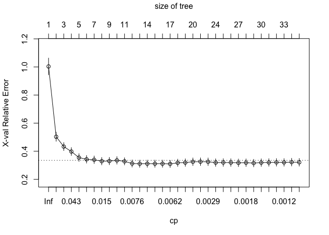
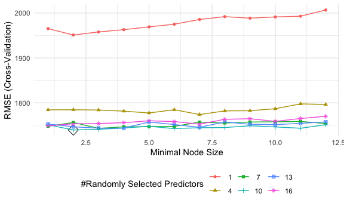
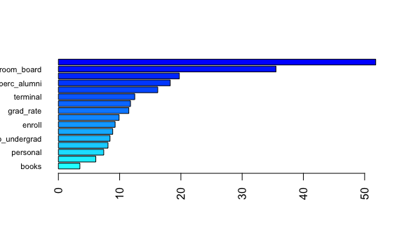

Data Science II Homework 4
================
Roxy Zhang
4/1/2022

## Question 1

``` r
set.seed(0409)

# data import and cleaning
df = read_csv("College.csv") %>% 
  janitor::clean_names() %>% 
  select(-college) %>% 
  select(outstate, everything()) %>% 
  na.omit()

# data partition
indexTrain = createDataPartition(y = df$outstate,
                                 p = 0.8,
                                 list = FALSE)


train_df = df[indexTrain, ]
test_df = df[-indexTrain, ]

x_train = model.matrix(outstate ~ ., train_df)[ , -1]
y_train = train_df$outstate

x_test = model.matrix(outstate ~ ., test_df)[ , -1]
y_test = test_df$outstate
```

``` r
# data dimension and summary
dim(train_df)
```

    ## [1] 453  17

``` r
summary(train_df)
```

    ##     outstate          apps           accept          enroll      
    ##  Min.   : 2340   Min.   :   81   Min.   :   72   Min.   :  35.0  
    ##  1st Qu.: 9100   1st Qu.:  632   1st Qu.:  501   1st Qu.: 207.0  
    ##  Median :11200   Median : 1179   Median :  884   Median : 335.0  
    ##  Mean   :11810   Mean   : 1970   Mean   : 1304   Mean   : 457.8  
    ##  3rd Qu.:13960   3rd Qu.: 2212   3rd Qu.: 1580   3rd Qu.: 527.0  
    ##  Max.   :21700   Max.   :20192   Max.   :13007   Max.   :4615.0  
    ##    top10perc       top25perc       f_undergrad     p_undergrad     
    ##  Min.   : 2.00   Min.   :  9.00   Min.   :  139   Min.   :    1.0  
    ##  1st Qu.:17.00   1st Qu.: 44.00   1st Qu.:  847   1st Qu.:   62.0  
    ##  Median :26.00   Median : 56.00   Median : 1298   Median :  205.0  
    ##  Mean   :29.76   Mean   : 57.75   Mean   : 1872   Mean   :  430.5  
    ##  3rd Qu.:37.00   3rd Qu.: 71.00   3rd Qu.: 2074   3rd Qu.:  541.0  
    ##  Max.   :96.00   Max.   :100.00   Max.   :27378   Max.   :10221.0  
    ##    room_board       books           personal         ph_d       
    ##  Min.   :2370   Min.   : 250.0   Min.   : 250   Min.   : 10.00  
    ##  1st Qu.:3740   1st Qu.: 450.0   1st Qu.: 800   1st Qu.: 61.00  
    ##  Median :4400   Median : 500.0   Median :1100   Median : 74.00  
    ##  Mean   :4567   Mean   : 540.4   Mean   :1225   Mean   : 72.02  
    ##  3rd Qu.:5330   3rd Qu.: 600.0   3rd Qu.:1500   3rd Qu.: 85.00  
    ##  Max.   :8124   Max.   :2000.0   Max.   :6800   Max.   :100.00  
    ##     terminal        s_f_ratio      perc_alumni        expend     
    ##  Min.   : 24.00   Min.   : 2.50   Min.   : 2.00   Min.   : 3186  
    ##  1st Qu.: 70.00   1st Qu.:11.10   1st Qu.:16.00   1st Qu.: 7477  
    ##  Median : 81.00   Median :12.80   Median :25.00   Median : 9060  
    ##  Mean   : 79.32   Mean   :13.03   Mean   :25.99   Mean   :10475  
    ##  3rd Qu.: 92.00   3rd Qu.:14.50   3rd Qu.:34.00   3rd Qu.:11487  
    ##  Max.   :100.00   Max.   :39.80   Max.   :64.00   Max.   :56233  
    ##    grad_rate     
    ##  Min.   : 15.00  
    ##  1st Qu.: 59.00  
    ##  Median : 69.00  
    ##  Mean   : 69.26  
    ##  3rd Qu.: 81.00  
    ##  Max.   :118.00

There are 453 rows and 17 columns in training data, all the variables
are numeric.

1.  Build a regression tree on the training data to predict the
    response. Create a plot of the tree.

``` r
set.seed(0409)

reg_tree = rpart(formula = outstate ~ . ,
                 data = train_df,
                 control = rpart.control(cp = 0)) 

# cp table
reg_tree_cptable = reg_tree$cptable

# cross-validation plot
plotcp(reg_tree)
```



``` r
# minimum cross_validation error
min_err = which.min(reg_tree_cptable[,4])

# pruning
reg_tree_prune = prune(reg_tree, 
                       cp = reg_tree_cptable[min_err,1])

#summary(reg_tree_prune) 
```

``` r
# make prediction
reg_tree_pred = predict(reg_tree_prune, newdata = test_df)

head(reg_tree_pred)
```

    ##         1         2         3         4         5         6 
    ## 12702.934  7875.794 11145.372 14950.897  8659.818 12702.934

``` r
RMSE(reg_tree_pred, test_df$outstate)
```

    ## [1] 2239.096

2.  Perform random forest on the training data. Report the variable
    importance and the test error.

``` r
set.seed(0409)

ctrl = trainControl(method = "cv")

rf_grid = expand.grid(mtry = seq(1, 16, 3),
                      splitrule = "variance",
                      min.node.size = 1:12)

rf_fit = train(outstate ~ .,
               data = train_df,
               method = "ranger",
               tuneGrid = rf_grid,
               trControl = ctrl)

rf_fit$bestTune
```

    ##    mtry splitrule min.node.size
    ## 38   10  variance             2

``` r
ggplot(rf_fit, highlight = TRUE)
```



``` r
set.seed(0409)

# extract variable importance using permutation
rf_per = ranger(outstate ~ . , 
                data = train_df,
                mtry = rf_fit$bestTune[[1]],
                splitrule = "variance",
                min.node.size = rf_fit$bestTune[[3]],
                importance = "permutation",
                scale.permutation.importance = TRUE)

# variable importance
barplot(sort(ranger::importance(rf_per), decreasing = FALSE), 
        las = 2, horiz = TRUE, cex.names = 0.7, 
        col = colorRampPalette(colors = c("cyan", "blue"))(19))
```



``` r
# make prediction
rf_pred = predict(rf_fit, newdata = test_df)

RMSE(rf_pred, test_df$outstate)
```

    ## [1] 1785.281

3.  Perform boosting on the training data. Report the variable
    importance and the test error.

## Question 2

2.  Perform boosting on the training data and report the variable
    importance. What is the test error rate?
