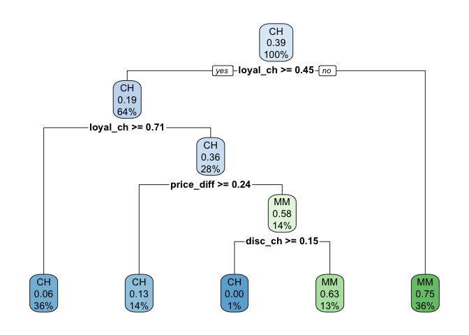

Data Science II Homework 4
================
Roxy Zhang
4/1/2022

## Question 1

``` r
set.seed(0409)

# data import and cleaning
df = read_csv("College.csv") %>% 
  janitor::clean_names() %>% 
  select(-college) %>% 
  select(outstate, everything()) %>% 
  na.omit()

# data partition
indexTrain = createDataPartition(y = df$outstate,
                                 p = 0.8,
                                 list = FALSE)


train_df = df[indexTrain, ]
test_df = df[-indexTrain, ]
```

``` r
# data dimension and summary
dim(train_df)
```

    ## [1] 453  17

``` r
summary(train_df)
```

    ##     outstate          apps           accept          enroll      
    ##  Min.   : 2340   Min.   :   81   Min.   :   72   Min.   :  35.0  
    ##  1st Qu.: 9100   1st Qu.:  632   1st Qu.:  501   1st Qu.: 207.0  
    ##  Median :11200   Median : 1179   Median :  884   Median : 335.0  
    ##  Mean   :11810   Mean   : 1970   Mean   : 1304   Mean   : 457.8  
    ##  3rd Qu.:13960   3rd Qu.: 2212   3rd Qu.: 1580   3rd Qu.: 527.0  
    ##  Max.   :21700   Max.   :20192   Max.   :13007   Max.   :4615.0  
    ##    top10perc       top25perc       f_undergrad     p_undergrad     
    ##  Min.   : 2.00   Min.   :  9.00   Min.   :  139   Min.   :    1.0  
    ##  1st Qu.:17.00   1st Qu.: 44.00   1st Qu.:  847   1st Qu.:   62.0  
    ##  Median :26.00   Median : 56.00   Median : 1298   Median :  205.0  
    ##  Mean   :29.76   Mean   : 57.75   Mean   : 1872   Mean   :  430.5  
    ##  3rd Qu.:37.00   3rd Qu.: 71.00   3rd Qu.: 2074   3rd Qu.:  541.0  
    ##  Max.   :96.00   Max.   :100.00   Max.   :27378   Max.   :10221.0  
    ##    room_board       books           personal         ph_d       
    ##  Min.   :2370   Min.   : 250.0   Min.   : 250   Min.   : 10.00  
    ##  1st Qu.:3740   1st Qu.: 450.0   1st Qu.: 800   1st Qu.: 61.00  
    ##  Median :4400   Median : 500.0   Median :1100   Median : 74.00  
    ##  Mean   :4567   Mean   : 540.4   Mean   :1225   Mean   : 72.02  
    ##  3rd Qu.:5330   3rd Qu.: 600.0   3rd Qu.:1500   3rd Qu.: 85.00  
    ##  Max.   :8124   Max.   :2000.0   Max.   :6800   Max.   :100.00  
    ##     terminal        s_f_ratio      perc_alumni        expend     
    ##  Min.   : 24.00   Min.   : 2.50   Min.   : 2.00   Min.   : 3186  
    ##  1st Qu.: 70.00   1st Qu.:11.10   1st Qu.:16.00   1st Qu.: 7477  
    ##  Median : 81.00   Median :12.80   Median :25.00   Median : 9060  
    ##  Mean   : 79.32   Mean   :13.03   Mean   :25.99   Mean   :10475  
    ##  3rd Qu.: 92.00   3rd Qu.:14.50   3rd Qu.:34.00   3rd Qu.:11487  
    ##  Max.   :100.00   Max.   :39.80   Max.   :64.00   Max.   :56233  
    ##    grad_rate     
    ##  Min.   : 15.00  
    ##  1st Qu.: 59.00  
    ##  Median : 69.00  
    ##  Mean   : 69.26  
    ##  3rd Qu.: 81.00  
    ##  Max.   :118.00

There are 453 rows and 17 columns in training data, all the variables
are numeric.

**(a) Build a regression tree on the training data to predict the
response. Create a plot of the tree.**

``` r
set.seed(0409)

reg_tree = rpart(formula = outstate ~ . ,
                 data = train_df,
                 control = rpart.control(cp = 0)) 

# cp table
reg_tree_cptable = reg_tree$cptable

# cross-validation plot
plotcp(reg_tree)
```


``` r
# minimum cross_validation error
min_err = which.min(reg_tree_cptable[,4])

# pruning
reg_tree_prune = prune(reg_tree, 
                       cp = reg_tree_cptable[min_err,1])

#summary(reg_tree_prune) 
```

``` r
# make prediction
reg_tree_pred = predict(reg_tree_prune, newdata = test_df)

head(reg_tree_pred)
```

    ##         1         2         3         4         5         6 
    ## 12702.934  7875.794 11145.372 14950.897  8659.818 12702.934

``` r
RMSE(reg_tree_pred, test_df$outstate)
```

    ## [1] 2239.096

**(b) Perform random forest on the training data. Report the variable
importance and the test error.**

``` r
set.seed(0409)

# using randomForest
rf = randomForest(outstate ~ .,
                  data = train_df,
                  mtry = 6)

rf_pred = predict(rf, newdata = test_df)

RMSE(rf_pred, test_df$outstate)
```

    ## [1] 1733.612

``` r
set.seed(0409)

# fast implementation using ranger
rf2 = ranger(outstate ~ .,
             data = train_df,
             mtry = 6)

rf2_pred = predict(rf2, data = test_df)$predictions

# test error
RMSE(rf2_pred, test_df$outstate)
```

    ## [1] 1724.522

-   The function `randomForest()` implements Breiman’s random forest
    algorithm. The test error is 1733.6117039.  
-   `ranger()` is a fast implementation of the algorithm above,
    particularly suit for high dimentional data. The test error is
    1724.5216241.

``` r
set.seed(0409)

# train random forest model using caret
ctrl = trainControl(method = "cv")

rf_grid = expand.grid(mtry = seq(1, 16, 3),
                      splitrule = "variance",
                      min.node.size = 1:12)

rf_grid_fit = train(outstate ~ .,
               data = train_df,
               method = "ranger",
               tuneGrid = rf_grid,
               trControl = ctrl)

rf_grid_fit$bestTune
```

    ##    mtry splitrule min.node.size
    ## 38   10  variance             2

``` r
ggplot(rf_grid_fit, highlight = TRUE)
```


``` r
set.seed(0409)

# extract variable importance using permutation
rf_per = ranger(outstate ~ . , 
                data = train_df,
                mtry = rf_grid_fit$bestTune[[1]],
                splitrule = "variance",
                min.node.size = rf_grid_fit$bestTune[[3]],
                importance = "permutation",
                scale.permutation.importance = TRUE)

# variable importance
barplot(sort(ranger::importance(rf_per), decreasing = FALSE), 
        las = 2, horiz = TRUE, cex.names = 0.7, 
        col = colorRampPalette(colors = c("cyan", "blue"))(19))
```


``` r
# make prediction
rf_grid_pred = predict(rf_grid_fit, newdata = test_df)

# test error
RMSE(rf_grid_pred, test_df$outstate)
```

    ## [1] 1785.281

**(c) Perform boosting on the training data. Report the variable
importance and the test error.**

``` r
set.seed(0409)

# fit a gradient boosting model with Gaussian loss function
boost = gbm(outstate ~ .,
            data = train_df,
            distribution = "gaussian",
            n.trees = 2000,
            interaction.depth = 3,
            shrinkage = 0.005,
            cv.folds = 10,
            n.cores = 2)

# plot loss function as a result of number of trees added to the ensemble
gbm.perf(boost, method = "cv")
```


    ## [1] 1669

``` r
best.iter = 1669

# check performance using the out-of-bag (OOB) error
# the OOB error typically underestimates the optimal number of iterations
gbm.perf(boost, method = "OOB")
```


    ## [1] 712
    ## attr(,"smoother")
    ## Call:
    ## loess(formula = object$oobag.improve ~ x, enp.target = min(max(4, 
    ##     length(x)/10), 50))
    ## 
    ## Number of Observations: 2000 
    ## Equivalent Number of Parameters: 39.99 
    ## Residual Standard Error: 1098

-   The green curve represents the cross-validation error, and the black
    curve represents the training error.  
-   The best cross-validation iteration was 1669, as is shown by the
    vertical dash line.

``` r
# plot relative influence of each variable
par(mfrow = c(1, 2))
summary(boost, n.trees = 1) # using first tree
```

    ##                     var   rel.inf
    ## expend           expend 92.030971
    ## top10perc     top10perc  7.969029
    ## apps               apps  0.000000
    ## accept           accept  0.000000
    ## enroll           enroll  0.000000
    ## top25perc     top25perc  0.000000
    ## f_undergrad f_undergrad  0.000000
    ## p_undergrad p_undergrad  0.000000
    ## room_board   room_board  0.000000
    ## books             books  0.000000
    ## personal       personal  0.000000
    ## ph_d               ph_d  0.000000
    ## terminal       terminal  0.000000
    ## s_f_ratio     s_f_ratio  0.000000
    ## perc_alumni perc_alumni  0.000000
    ## grad_rate     grad_rate  0.000000

``` r
summary(boost, n.trees = best.iter) # using estimated best number of trees
```


    ##                     var    rel.inf
    ## expend           expend 57.5426958
    ## room_board   room_board 11.6002893
    ## perc_alumni perc_alumni  3.8092300
    ## grad_rate     grad_rate  3.6396079
    ## apps               apps  3.5866388
    ## accept           accept  3.0722912
    ## terminal       terminal  3.0227693
    ## ph_d               ph_d  2.5399454
    ## f_undergrad f_undergrad  2.0796704
    ## personal       personal  1.7792895
    ## s_f_ratio     s_f_ratio  1.6170697
    ## top10perc     top10perc  1.4212408
    ## top25perc     top25perc  1.2473544
    ## p_undergrad p_undergrad  1.1843613
    ## enroll           enroll  1.0359470
    ## books             books  0.8215991

-   The left plot shows the variable influence of the first tree, the
    right plot shows the variable influence of the estimated best number
    of trees.  
-   `expend`, `apps`, `ph_d`, `top10perc`, and `books` are important
    variables, which are consistent with the variable importance in
    caret.

``` r
# predict on the new data using the "best" number of trees
# by default, predictions will be on the link scale
boost_pred = predict(boost,
                     newdata = test_df,
                     n.trees = best.iter,
                     type = "link")

# test error
RMSE(boost_pred, test_df$outstate)
```

    ## [1] 1713.395

-   The test error is 1713.3953364, which is smaller than the test error
    1785.2810445 from the tuned model from caret.

## Question 2

``` r
# data import and cleaning
data(OJ)

OJ_df = OJ %>% 
  janitor::clean_names() %>% 
  relocate("purchase", .after = "store") %>% 
  mutate(purchase = as.factor(purchase)) %>% 
  na.omit()

dim(OJ_df)
```

    ## [1] 1070   18

``` r
summary(OJ_df)
```

    ##  weekof_purchase    store_id       price_ch        price_mm    
    ##  Min.   :227.0   Min.   :1.00   Min.   :1.690   Min.   :1.690  
    ##  1st Qu.:240.0   1st Qu.:2.00   1st Qu.:1.790   1st Qu.:1.990  
    ##  Median :257.0   Median :3.00   Median :1.860   Median :2.090  
    ##  Mean   :254.4   Mean   :3.96   Mean   :1.867   Mean   :2.085  
    ##  3rd Qu.:268.0   3rd Qu.:7.00   3rd Qu.:1.990   3rd Qu.:2.180  
    ##  Max.   :278.0   Max.   :7.00   Max.   :2.090   Max.   :2.290  
    ##     disc_ch           disc_mm         special_ch       special_mm    
    ##  Min.   :0.00000   Min.   :0.0000   Min.   :0.0000   Min.   :0.0000  
    ##  1st Qu.:0.00000   1st Qu.:0.0000   1st Qu.:0.0000   1st Qu.:0.0000  
    ##  Median :0.00000   Median :0.0000   Median :0.0000   Median :0.0000  
    ##  Mean   :0.05186   Mean   :0.1234   Mean   :0.1477   Mean   :0.1617  
    ##  3rd Qu.:0.00000   3rd Qu.:0.2300   3rd Qu.:0.0000   3rd Qu.:0.0000  
    ##  Max.   :0.50000   Max.   :0.8000   Max.   :1.0000   Max.   :1.0000  
    ##     loyal_ch        sale_price_mm   sale_price_ch     price_diff      store7   
    ##  Min.   :0.000011   Min.   :1.190   Min.   :1.390   Min.   :-0.6700   No :714  
    ##  1st Qu.:0.325257   1st Qu.:1.690   1st Qu.:1.750   1st Qu.: 0.0000   Yes:356  
    ##  Median :0.600000   Median :2.090   Median :1.860   Median : 0.2300            
    ##  Mean   :0.565782   Mean   :1.962   Mean   :1.816   Mean   : 0.1465            
    ##  3rd Qu.:0.850873   3rd Qu.:2.130   3rd Qu.:1.890   3rd Qu.: 0.3200            
    ##  Max.   :0.999947   Max.   :2.290   Max.   :2.090   Max.   : 0.6400            
    ##   pct_disc_mm      pct_disc_ch      list_price_diff     store       purchase
    ##  Min.   :0.0000   Min.   :0.00000   Min.   :0.000   Min.   :0.000   CH:653  
    ##  1st Qu.:0.0000   1st Qu.:0.00000   1st Qu.:0.140   1st Qu.:0.000   MM:417  
    ##  Median :0.0000   Median :0.00000   Median :0.240   Median :2.000           
    ##  Mean   :0.0593   Mean   :0.02731   Mean   :0.218   Mean   :1.631           
    ##  3rd Qu.:0.1127   3rd Qu.:0.00000   3rd Qu.:0.300   3rd Qu.:3.000           
    ##  Max.   :0.4020   Max.   :0.25269   Max.   :0.440   Max.   :4.000

``` r
set.seed(0409)

# data partition
OJ_indexTrain = createDataPartition(y = OJ_df$purchase,
                                 p = 0.653,
                                 list = FALSE)

OJ_train_df = OJ_df[OJ_indexTrain, ]
OJ_test_df = OJ_df[-OJ_indexTrain, ]
```

**(a) Build a classification tree using the training data, with Purchase
as the response and the other variables as predictors. Use
cross-validation to determine the tree size and create a plot of the
final tree. Which tree size corresponds to the lowest cross-validation
error? Is this the same as the tree size obtained using the 1 SE rule?**

**Min MSE rule:**

``` r
set.seed(0409)

# fit classification model using rpart
class_tree = rpart(purchase ~ . , 
                   data = OJ_train_df,
                   control = rpart.control(cp = 0))

# tract cp table
OJ_cp_table = printcp(class_tree)
```

    ## 
    ## Classification tree:
    ## rpart(formula = purchase ~ ., data = OJ_train_df, control = rpart.control(cp = 0))
    ## 
    ## Variables actually used in tree construction:
    ## [1] disc_ch         list_price_diff loyal_ch        price_ch       
    ## [5] price_diff      store_id       
    ## 
    ## Root node error: 273/700 = 0.39
    ## 
    ## n= 700 
    ## 
    ##          CP nsplit rel error  xerror     xstd
    ## 1 0.4542125      0   1.00000 1.00000 0.047270
    ## 2 0.0293040      1   0.54579 0.58974 0.040785
    ## 3 0.0256410      3   0.48718 0.56410 0.040146
    ## 4 0.0128205      4   0.46154 0.51648 0.038869
    ## 5 0.0073260     11   0.36264 0.49451 0.038237
    ## 6 0.0036630     12   0.35531 0.49451 0.038237
    ## 7 0.0018315     13   0.35165 0.49084 0.038128
    ## 8 0.0000000     17   0.34432 0.50549 0.038556

``` r
# extract min MSE
OJ_min_MSE = which.min(OJ_cp_table[ , 4])

# plot cross-validation error agiainst cp
plotcp(class_tree)
```


``` r
# obtain final tree using min MSE
cp_MSE = OJ_cp_table[OJ_min_MSE, 1]

class_tree_prune = prune(class_tree, cp = cp_MSE)

# plot final tree
rpart.plot(class_tree_prune)
```


**1 SE rule:**

``` r
set.seed(0409)

# obtain final tree using 1SE
cp_1SE = OJ_cp_table[OJ_cp_table[ , 4] < OJ_cp_table[OJ_min_MSE, 4] + OJ_cp_table[OJ_min_MSE, 5], 1][1]

class_tree_prune_1SE = prune(class_tree, 
                             cp = cp_1SE)

# plot fianl tree
rpart.plot(class_tree_prune_1SE)
```



**(b) Perform boosting on the training data and report the variable
importance. What is the test error rate?**
